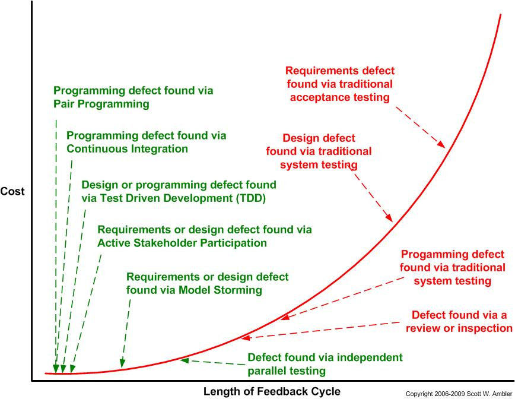
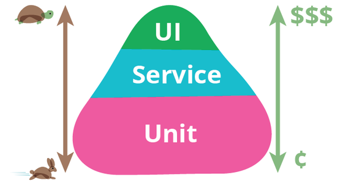

<a href="./LICENSE.md">

</a>

# Modern Java/JVM Build Practices

[](https://github.com/binkley/modern-java-practices/actions)
[](https://github.com/binkley/modern-java-practices/pulls)
[](https://github.com/binkley/modern-java-practices/issues/)
[](https://snyk.io/test/github/binkley/modern-java-practices)
[](http://unlicense.org/)

**Modern Java/JVM Build Practices** is an article-as-repo on building modern
Java/JVM projects using
[Gradle](https://docs.gradle.org/current/userguide/userguide.html) and
[Maven](https://maven.apache.org/what-is-maven.html), and a _starter project_
for Java.

The focus is _best build practices_ and _project hygiene_.
This document is _agnostic_ between Gradle and Maven: discussion in each section
covers both tools (alphabetical order, Gradle before Maven).
See [_My Final Take on Gradle (vs.
Maven)_](https://blog.frankel.ch/final-take-gradle/) for an opinionated view.

This is not a JVM starter for only Java:
I use it for starting my Kotlin projects, and substitute complilation and code
quality plugins.
Any language on the JVM can find practices and tips.

As a _guide_, this project focuses on:

* A quick starter for JVM projects using Gradle or Maven.
  [Fork](https://github.com/binkley/modern-java-practices/fork) me,
  [clone](https://github.com/binkley/modern-java-practices.git) me, copy/paste
  freely!
  I am [_Public Domain_](http://unlicense.org/)
* Discuss&mdash;and illustrate (through code)&mdash;sensible default practices;
  highlight good build tools and plugins
* Document pitfalls that turned up.
  Some were easy to address after Internet search; some were challenging
  (see "Tips" sections)
* Do not be an "all-in-one" solution. You know your circumstances best.
  I hope this project helps you discover build improvements you love.
  Please share with others through
  [issues](https://github.com/binkley/modern-java-practices/issues) or
  [PRs](https://github.com/binkley/modern-java-practices/pulls)

### Two recurring themes

* _Shift problems left_ &mdash; Find issues earlier in your build&mdash;before
  you see them in production
* _Make developer life easier_ &mdash; Automate build tasks often done by
  hand: get your build to complain (_fail_) locally before sharing with your
  team, or fail in CI before deployment

### What is a _Starter_?

A project starter has several goals:
- Help a new project get up and running with minimal fuss

This starter project is focused on _build_:
- Easy on-ramp for new folks to try out your project for themselves
- Support new contributors to your project that they become productive quickly
- Support current contributors in the build, get out of their way, and make
  everyday things easy

This starter project has minimal dependencies.
The focus is on Gradle and Maven plugins and configuration so that you and
contributors can focus on the code, not on setting up the build.

### Summing up

- _I'm not a great programmer; I'm just a good programmer with great habits._
  &mdash;
  [Kent Beck](https://www.goodreads.com/quotes/532211-i-m-not-a-great-programmer-i-m-just-a-good-programmer)
- _Make it work, make it right, make it fast_
  &mdash; [C2 Wiki](http://wiki.c2.com/?MakeItWorkMakeItRightMakeItFast)

**NB** &mdash; This is a _living document_.
The project is frequently updated to pick up new dependency or plugin 
versions, and improved practices; this README updates recommendations.
This is part of what _great habits_ look like.
See [_Reusing this project_](#reusing-this-project) for tips on pulling in
updates.

(Credit to Yegor Bugayenko for [_Elegant
READMEs_](https://www.yegor256.com/2019/04/23/elegant-readme.html).)

<a title="Try it">

</a>

## Try it

After cloning or forking this project to your machine, try out the build
combination that makes sense for you:

```shell
$ ./gradlew build  # Local-only build
$ ./batect build-with-gradle  # CI build with Batect
$ earthly +build-with-gradle  # CI build with Earthly
$ ./mvnw verify  # Local-only build
$ ./batect build-with-maven  # CI build with Batect
$ earthly +build-with-maven  # CI build with Earthly
```

(You may find that the "CI" build works great for you locally as part of your
regular command line.
Most IDEs would use the "local-only" build.)

See what the starter program does:

```shell
$ ./run-with-gradle.sh
$ ./run-with-maven.sh
```

---

<a title="Changes">

</a>

## Recent significant changes

- Gradle: Refactor to JVM21 build, with Version Catalogs, build caching, and
  support for dependency verification/locking and SBOMs.

- Gradle: remove use of `testsets` plugin for integration testing in favor of
  native Gradle. This is in support of Gradle 8

---

<a title="Table of Contents">

</a>

## TOC

* [Try it](#try-it)
* [Recent significant changes](#recent-significant-changes)
* [Introduction](#introduction)
* [Reusing this project](#reusing-this-project)
* [Contributing](#contributing)
* [You and your project](#you-and-your-project)
* [Getting your project started](#getting-your-project-started)
* [The JDK](#the-jdk)
* [Use Gradle or Maven](#use-gradle-or-maven)
* [Setup your CI](#setup-your-ci)
* [Keep local consistent with CI](#keep-local-consistent-with-ci)
* [Maintain your build](#maintain-your-build)
* [Choose your code style](#choose-your-code-style)
* [Generate code](#generate-code)
* [Leverage the compiler](#leverage-the-compiler)
* [Use linting](#use-linting)
* [Use static code analysis](#use-static-code-analysis)
* [Shift security left](#shift-security-left)
* [Leverage unit testing and coverage](#leverage-unit-testing-and-coverage)
* [Use mutation testing](#use-mutation-testing)
* [Use integration testing](#use-integration-testing)
* [Debugging](#debugging)
* [Samples](#samples)
* [Going further](#going-further)
* [Problems](#problems)
* [Credits](#credits)

---

<a href="https://modernagile.org/" title="Modern Agile">

</a>

## Introduction

Hi! I want you to have _awesome builds_ 🟢. If you're on a *Java* project,
or a project on any
*[JVM language](https://en.wikipedia.org/wiki/List_of_JVM_languages)*
(Clojure, Groovy, JRuby, Java, Jython, Kotlin, Scala, _et al_), this article is
for you.
This article assumes you are using Gradle or Maven for your build locally, and
in CI.
Some of you are using other build systems native to your source language.
Please follow along!

**What is the goal of this article?** I want to highlight modern practies in
building Java/JVM projects with Gradle or Maven, and provide guidance, or at
least food for thought.
The sample Gradle and Maven projects use Java, but most recommendations apply to
builds for _any_ JVM language.
I'll never be as clever or as talented as [_why the lucky stiff_](http://poignant.guide/book/), but I
hope writing this makes you, developers, and others happy.

See the wheel to the right?
_No, you do not need to be agile!_
(But I encourage you to explore the benefits of Agile.)
This article is for you regardless of how your team approaches software.
The point is to _"make people awesome"_ for any project, possibly the most key
value of the Agile approach to software.

### Principles in designing these builds

1. _Make it work_
    - Can I as a Day 1 developer build the project locally?
    - Can I hand the project off to someone else to try?
2. _Make it right_
    - Can I reproduce issues in the CI build, and fix it locally?
    - Can I find code and security issues from running the build?
    - Is the code clean? Am I happy to explore the project?
3. _Make it fast_
    - Can I run the local build as frequently as I like, and be productive?
    - Can I have a fast cycle of code &amp; test? What about red-green-refactor?
    - Can I update my dependencies and plugins quickly and easily?

### Goals for this project

* Starter build scripts for Modern Java/JVM builds in Gradle and Maven, helpful
  for new projects, or refurbishing existing projects
* Quick solutions for raising project quality and security in your local build
* Shift _problems to the left_ ("to the left" meaning earlier in the development
  cycle). You'll get earlier feedback while still having a fast local build.
  Time spent fixing issues locally is better than waiting on CI to fail, or
  worse, for production to fail
* The article focuses on Gradle and Maven: these are the most used build tools
  for Modern Java/JVM projects. However, if you use a different build tool, the
  principals still apply

I want to help with the question: _I am in Day 1 on my project_: How do I begin
with a local build that supports my team through the project lifetime?
And when I have an existing project, how to I catch up?

### Goal of this article

[_Make people awesome_](https://modernagile.org/) (that means _you_). This
project is based on the experiences of many, and experiments with Modern 
Java/JVM builds, and shares lessons learned with you.

---

<a href="https://github.com/binkley/modern-java-practices/fork" title="Reuse">

</a>

## Reusing this project

Don't forget to [_fork
me_](https://github.com/binkley/modern-java-practices/fork) or _clone_ me! This
is [_Public Domain_](http://unlicense.org/) software: it is meant to be reused
by you however is sensible.
If you fork, I take care that upstream pulls work, but I'd like to [hear from
you](https://github.com/binkley/modern-java-practices/issues) if you have
trouble.
See also: [_Cleaning
up_](https://github.com/binkley/modern-java-practices#cleaning-up).

Sensible approaches:

- Fork this project, and work from there, pulling down improvements (usually 
  version bumps on tools and dependencies)
- Clone this project to a new repository, and work from there. Manually pull 
  over improvements (there is [tooling to
  help](https://github.com/binkley/modern-java-practices#keep-plugins-and-dependencies-up-to-date))
- Read through this repository's code and changes, and update your own 
  repository by hand, useful for existing repositories

If you cloned this project as a starter, you may want to stay updated on
improvements:

```
git remote add upstream https://github.com/binkley/modern-java-practices.git
git fetch upstream
git merge master/upstream
```

Once you are happy with your project, you should think about removing the
upstream remote, and reviewing changes in this repository by hand.
Your decision might depend on what merge conflicts you encounter.

### Tips

* Consider [_Clone git repository without
  history?_](https://stackoverflow.com/questions/30001304/clone-git-repository-without-history)
  to start at the current tip of this project. For example, some images in
  `README.md` started overlarge in earlier versions, something you may not want
  in a clone
* _Caution_: Not all the images used in [`README.md`](./README.md) may be in the
  Public Domain (this is challenging to research). Use due diligence before
  sharing your clone, and other licenses may apply for these images in a
  global context

### Irrelevant files

This project includes files which are helpful for maintaining itself, but may 
be irrelevant to you. Some, however, may prove helpful in specific contexts as 
noted:
- [`build-as-ci-does.sh`](./build-as-ci-does.sh)
  Helpful when CI has steps that local developers do not, and you want to 
  reproduce or explore locally a CI problem. The script should match the 
  actions your CI takes on pushes (this project uses GitHub actions)
- [`compare-tooling-versions-sh`](./compare-tooling-versions.sh)
  If your project supports _both_ Gradle and Maven builds (unlikely), a 
  quick way to look at dependency and plugin versions between the two.
  Note that the ouput needs _human_ reading: the same tool version may appear
  as different lines when comparing
- [`coverage`](./coverage.sh)
  Checks if the local code passes at given levels of code coverage.
  The script is focused on Maven, but with edits would do the same for Gradle.
  This supports the ["ratchet" pattern](#leverage-unit-testing-and-coverage)
- [`run-with-gradle.sh`](./run-with-gradle.sh)
  If you are a Gradle project, you will likely rename this to just `run` or 
  similar
- [`run-with-maven.sh`](./run-with-maven.sh)
  If you are a Maven project, you will likely rename this to just `run` or
  similar

## Contributing

See [`CONTRIBUTING.md`](./CONTRIBUTING.md).
Please [file issues](https://github.com/binkley/modern-java-practices/issues),
or contribute [pull
requests](https://github.com/binkley/modern-java-practices/pulls)!
I'd love a conversation with you.

---

<!-- TODO: Should this section be moved or removed? It is awkward here -->
## You and your project

There are simple ways to make your project great. Some goals to strive for:

* Visitors and new developers get off to a quick start, and can understand what
  the build does (if they are interested)
* Users of your project trust it&mdash;the build does what it says on the
  tin&mdash;, and they feel safe relying on your project
* You don't get peppered with questions that are answered "in the source"
  &mdash;because not everyone wants to read the source, and you'd rather be
  coding than answering questions ☺
* Coding should feel easy. You solve _real_ problems, and do not spend overmuch
  much time on build details: your build supports you
* Your code passes "smell tests": no simple complaints, and you are proud of
  what others see. _Hey!_ You're a professional, and it shows. (This is one of
  my personal fears as a programmer)
* Your project is "standard", meaning, the build is easily grasped by those
  familiar with standard techniques and tooling

Hopefully this article and the sample build scripts help you!

---

## Getting your project started

To get a project off to a good start, consider these items. Even for existing
projects, you should address these as you go along or while refurbishing an
existing project:

* **Team agreement comes first**. Make sure everyone is onboard and clear on
  what build standards are, and understands&mdash;at least as an
  outline&mdash;what the build does for them
* Provide a *good* `README.md`. This saves you a ton of time in the long run.
  This is your _most important_ step. A good resource is Yegor's
  [_Elegant READMEs_](https://www.yegor256.com/2019/04/23/elegant-readme.html)
    * [Intelligent laziness is a virtue](https://thethreevirtues.com/). Time
      invested in good documentation pays off
    * A good [`README.md`](./README.md) answers visitors questions, so you don't
      spend time answering trivial questions, and explains/justifies your
      project to others.
    * Fight [Conway's Law](https://en.wikipedia.org/wiki/Conway%27s_law) with
      communication!
* Pick a version of Java, and stick to it throughout your local build, CI
  pipeline, and environment deployments. _Do not mix versions._
* Pick **Gradle** or **Maven**, and use only one. This project provides both to
  demonstrate equivalent builds for each. See
  [Use Gradle or Maven](#use-gradle-or-maven) for more discussion
* Use build wrappers committed into your project root. These run Gradle or
  Maven, and coders should always invoke `./gradlew` or `./mvnw` (use shell
  _aliases_ if these grow tiresome to type)
    * Build wrappers are shell scripts to run Gradle or Maven. The wrapper takes
      care of downloading needed tools without getting in the way. New
      contributors and developers can start right away; they do not need to
      install more software
    * For Gradle, use
      [`./gradlew`](https://docs.gradle.org/current/userguide/gradle_wrapper.html)
      (part of Gradle)
    * For Maven, use [`./mvnw`](https://maven.apache.org/wrapper/) (a plugin)
* Always run CI on push to a shared repository. It's a sad panda when someone is
  excited about their commit, and then the commit breaks the other developers
    * In CI, use caches for dependency downloads; this speeds up the feedback
      cycle from CI (see [below](#setup-your-ci))
    * When sensible, move code quality and security checks into local builds
      before changes hit CI (see [below](#setup-local-ci))
* Pick a common code style, and stay consistent; update tooling to complain on
  style violations
    * The team should agree on a common code style, _eg_, SUN, Google, _et al_
    * See [Use linting](#use-linting)

### Tips

* Consider using client-side Git hooks for `pre-push` to run a full, clean,
  local build. This helps ensure "oopsies" from going to CI where they impact
  everyone. The options are broad. Try web searches on:
    * "gradle install git hooks"
    * "maven install git hooks"

  This article presently has no specific recommendations on choices of plugin or
  approach for Git hooks.

---

<a href="https://adoptium.net/" title="Adoptium">

</a>

## The JDK

For any Modern Java/JVM project, the first decision is _which version of Java
(the JDK)_ to use? Some guidelines:

* Java 17 is the most current LTS ("long-term support") version
* There are more recent versions with continuing improvements and additional 
  features to try out
* If your personal or open-source project does not require a paid support
  contract, newer Java versions are a good choice
* For a full breakdown of the current JDK landscape (as of Jul 2022), see
  [_Which JDK Version and Vendor Should You Use on Your
  Project?_](https://tomgregory.com/which-jdk-version-and-vendor/), and a short
  list of recommendations at [_Which Version of JDK Should I
  Use?_](https://whichjdk.com)

In this project, you'll see the choice of Java 17 as this is the version to
recommend in production.

In general, you will find that [Adoptium](https://adoptium.net) is a go-to
choice for the JDK.

### Tips

* In Maven, use a property to _fix_ the version of Java in place. But note
  naming for that property: `java.version` is defined by the JVM, and Maven
  creates a matching property. Recommended is to define your Java version with
  the `jdk.version` property, which has no collision with pre-defined
  properties
* In Gradle, use the `javaToolchains` task to investigate issues with
  mismatching or confusing build paths, project configuration, and Gradle
  sorting it out. This is an issue for local-only builds; local builds using a
  container (such as via [_Batect_](#setup-local-ci)) lower these concerns
* In GitHub Actions, building supports cross-checking multiple JVM versions,
  use
  [the `matrix` feature](https://docs.github.com/en/actions/using-jobs/using-a-matrix-for-your-jobs).
  See [the example GitHub actions](./.github/workflows/ci-batect-maven.yml)

### Managing your Java environment

Two best-of-class tools come to mind to manage your JDK environment in projects:

* [jEnv](#jenv)
* [Direnv](#direnv)

Both assume UNIX-type shells (Bash, Zsh, etc).

For those on Windows, you may need to use Cygwin, Git for Windows, or WSL2 to
use these.

(Reminder: in general, when setting up your project environment, prefer the 
latest LTS version of Java, which is 17.)

#### Jenv

[jEnv](https://www.jenv.be/) supports both "global" (meaning you, the user)
and "project" choices of JDK (particular to a directory and its children) in
which JDK installation to use. You may notice the
[`.java-version`](./.java-version) file: this is a per-project file for jEnv to
pick your project Java version.

Do use `jenv enable-plugins export` and restart your shell. This ensures
`JAVA_HOME` is exported to match your jEnv settings. Several tools use
`JAVA_HOME` rather than the `java` or `javac` found in your `PATH`.

You may also find the `gradle` and `maven` plugins for jEnv useful.

There are many ways to install the JDK, most are platform-dependent. In general,
your team will be better off using a "managed" approach, rather than with each
person using binary installers. Popular choices include:

* [Apt and friends](https://adoptium.net/installation.html#linux-pkg) for Linux
  or WSL
* [Homebrew](https://brew.sh/) for Mac
* [SDKMAN](https://sdkman.io/jdks) for multiple platforms

#### Direnv

[direnv](https://direnv.net/) is more general. Rather than specifying a Java
version, you edit a `.envrc` file and add JDK-specific environment settings
(and another other environment settings) just as you would on the command-line.
Typically set are `PATH` to find `java` and `javac` programs, and `JAVA_HOME`.

---

<!--- TODO: better formating for images vs text -->
<a href="https://maven.apache.org/" title="Maven">
</a>
<a href="https://gradle.org/" title="Gradle">
</a> 

## Use Gradle or Maven

The choice between Gradle and Maven depends on your team, your broader
ecosystem, and your project needs. In summary:

* Gradle &mdash; your build script is written in Groovy or Kotlin; dynamic,
  imperative, and mutable; requires debugging your build on occasion, but less
  verbose than Maven's XML. Use of "parent" (umbrella) projects is possible but
  challenging. You can locally extend your build script either _inline_
  with build code, with project plugins, or with plugins from a separate
  project (perhaps shared across project for your team). If interested in custom
  plugins,
  [read more here](https://docs.gradle.org/current/userguide/custom_plugins.html)

* Maven &mdash; your build scripts is written in XML; declarative and immutable;
  verbose but specific; it either works or not. Use of "parent" (umbrella)
  projects is simple with built-in support. You can locally extend your build
  with plugins from a separate project (perhaps shared across project for your
  team). If interested in custom plugins,
  [read more here](https://maven.apache.org/guides/plugin/guide-java-plugin-development.html)

For Modern Java/JVM projects, **use Gradle or Maven**. The article doesn't cover
alternative build tools:
[industry data](https://www.jrebel.com/blog/2020-java-technology-report#build-tool)
shows Gradle or Maven are the build tools for most folks. Unless you find
yourself in a complex monorepo culture (Google, _etc._), or there are mandates
from above, you need to select one of Gradle or Maven. However, for projects not
using Gradle or Maven, you will still find improvements for your build herein
(though details will differ).

For new projects, you may find [Spring Initializr](https://start.spring.io),
[`mn` from Micronaut](https://micronaut.io/), or
[JHipster](https://www.jhipster.tech/), among many other project excellent 
starters, more to your liking: they provide you with starter Gradle or Maven 
scripts specific for those frameworks. _That's great!_ This article should 
still help you improve your build beyond "getting started". You should pick 
and choose build features as makes sense to you and your circumstances.

This article offers **no preference between Gradle or Maven**. You need to
decide with your team and circumstances. After picking your build tool, you 
might rename [run-with-gradle.sh](./run-with-gradle.sh) or
[runs-with-maven.sh](./run-with-maven.sh) to just `run.sh` or similar.

Projects using Ant **should migrate**. It is true that Ant is well-maintained
(the latest version dates from 2021). However, you will spend much effort in 
providing modern build tooling, and effort in migrating from Ant is repaid in 
smaller work for integrating modern tools. Data point: consider the number of
[Stackoverflow](https://stackoverflow.com/) posts providing Gradle or 
Maven answers to those for Ant.  *Consider Ant builds to be no longer 
well-supported, and a form of
[Tech Debt](https://www.martinfowler.com/bliki/TechnicalDebt.html).*

Throughout, when covering both Gradle and Maven, Gradle will be discussed first,
then Maven. This is no expressing a preference!  It is neutral alphabetical
ordering.

**NB** &mdash; Gradle Enterprise provides additional features for Maven as
well such as [build
caching](https://docs.gradle.com/enterprise/maven-build-cache/) and [build
scans](#keep-your-build-fast).

### Cleaning up

Once you pick between Gradle or Maven, it is a good time to clean up.
If you have cloned the project, some renames/deletions to consider:

* [run-with-gradle.sh](./run-with-gradle.sh) or
  [runs-with-maven.sh](./run-with-maven.sh) → just `run.sh` or `build.sh` or 
  anything you like. Remember to document in `README.md` for others
* [batect.yml](./batect.yml) &mdash; update the task names, and remove those not
  relevant. Again, don't forget about `README.md` instructions
* [ci.yml](./.github/workflows/ci-maven.yml) &mdash; update the jobs, and remove those
  not relevant. Did I mention `README.md`?

You are ready to make great software.

### Keeping Gradle or Maven up to date

#### Gradle

To update Gradle:

```shell
$ $EDITOR gradle.properties  # Update gradleWrapperVersion property
$ ./gradlew wrapper  # Update scripts and supporting files
$ ./gradlew wrapper  # Confirm, and download files if needed
```

#### Maven

To update Maven:

```shell
$ $EDITOR pom.xml  # Update maven.version property
$ ./mvnw wrapper:wrapper  # Update scripts and supporting files
$ ./mvnw wrapper:wra  # Confirm, and download files if needed
```

Note that Maven wrapper is developing, and will be bundled with an upcoming
Maven release.
For now it is a separate plugin in your `pom.xml`.

### Tips

* Take advantage of your shell's tab completion:
  - [Gradle completion](https://github.com/gradle/gradle-completion)
  - [Maven completion](https://github.com/juven/maven-bash-completion)
* The sample Gradle and Maven build scripts often specify specific versions of
  the tooling, separate from the plugin versions. This is intentional. You
  should be able to update the latest tool version even when the plugin has not
  yet caught up
* Gradle itself does not provide support for "profiles", a key Maven feature.
  This is _different_ from _profiling_ build performance!  Maven profiles
  can be used in many ways. The most common are to enabling/disabling build
  features on the command line, tailoring the build to a particular deployment
  environment, or using different credentials for other systems. If this 
  feature is important for your team, you can code `if/else` blocks directly 
  in `build.gradle`, or use a plugin such as
  [Kordamp Profiles Gradle plugin](https://kordamp.org/kordamp-gradle-plugins/#_org_kordamp_gradle_profiles)
  (Kordamp has a suite of interesting Gradle plugins beyond this one; read more
  on that page)
* Gradle uses advanced terminal control, so you cannot always see what is
  happening. To view Gradle steps plainly when debugging your build, use:
  ```shell
  $ ./gradlew <your tasks> | cat
  ```
  or save the output to a file:
  ```shell
  $ ./gradlew <your tasks> | tee -o some-file
  ```
* If your source code is in Kotlin, so should be your build. Gradle provides
  [a Kotlin DSL for build scripts](https://kotlinlang.org/docs/reference/using-gradle.html)
  as a first-class counterpart to the traditional Groovy DSL
* Maven colorizes output, but does not use terminal control to overwrite output
* See [Setup your CI](#setup-your-ci) for another approach to getting plain text
  console output
* [The Maven Notifier](https://github.com/jcgay/maven-notifier) may be to your
  liking
* If you like Maven, but XML isn't your thing, you might explore the
  [_Polyglot for Maven_](https://github.com/takari/polyglot-maven) extension
  which provides the POM in multiple languages/formats (_eg_, Ruby, YAML, many
  others)
* If you have a multi-module Maven build, you might consider
  [_Takari Smart
  Builder_](http://takari.io/book/30-team-maven.html#takari-smart-builder)
  to speed it up
* Maven best practice is to specify the version for each plugin, _even default
  plugins_ that come with your version of Maven. This enforces
  **reproducible builds**. See also the
  [Maven Enforcer Plugin](https://maven.apache.org/enforcer/maven-enforcer-plugin/)
  to exactly specify the version of Maven for your build

---

<a href="http://www.ambysoft.com/essays/whyAgileWorksFeedback.html"
title="Why Agile Software Development Techniques Work: Improved Feedback">

</a>

## Setup your CI

Your CI is your "source of truth" for successful builds. Your goal:
_Everyone trusts a "green" CI build is solid_.

When using GitHub, a simple starting point is
[`ci-gradle.yml`](./.github/workflows/ci-gradle.yml) or
[`ci-maven.yml`](./.github/workflows/ci-maven.yml).
(GitLab is similar, but as this project is hosted in GitHub, there is not a 
simple means to demonstrate CI at GitLab).
This project includes a workflow for Gradle and a workflow for Maven as
examples.

If you use GitLab, read about the equivalent in
[_GitLab CI/CD_](https://docs.gitlab.com/ee/ci/), or for Jenkins in
[_Pipeline_](https://www.jenkins.io/doc/book/pipeline/).

When publishing your project, consider
[_Publishing Java packages with
Maven_](https://docs.github.com/en/actions/guides/publishing-java-packages-with-maven)
for GitHub, or equivalent for other CI systems.  **Do not publish from local
builds.**  For GitHub, note the limitations of
[_Download from Github Package Registry without
authentication_.](https://github.community/t/download-from-github-package-registry-without-authentication/14407)

### Save your CI artifacts

It is helpful to preserve your build artifacts from CI, for example, to 
download built jars from different CI runs for comparing their behavior 
between commits without needing to rebuild locally, and also to confirm that 
your local build makes the same jars as CI does.

The "Build with Gradle" and "Build with Maven" CI workflows each provide a 
download named "jars", and the Maven build a "site" download.

There are services to provide links to the most recent build artifacts.
One example is [nightly.link](https://nightly.link/) (this is not an 
endorsement).
You can use these links in your `README.md` or share as makes sense.
An example is
[downloading the Maven-built jar](https://nightly.link/binkley/modern-java-practices/workflows/ci-maven/master/jars.zip)
from this project.

### Tips

* To disable ASCII colorizing printing as control sequences in CI, or
  Gradle trying to overwrite lines (control sequences make for hard-to-read 
  CI logs), a simple approach is to use an environment setting:
  ```shell
  TERM=dumb
  ```
  This does not make sense for local builds, and your CI system (_eg_, GitHub)
  may manage this problem already
* With Gradle, use the `--warning-mode=all` flag for CI: this shows _all_
  warnings Gradle generates, not just a summary. See
  [_Showing or hiding
  warnings_](https://docs.gradle.org/current/userguide/command_line_interface.html#sec:command_line_warnings)
  for details
* With Maven, use the `--no-transfer-progress` flag for CI: this avoids spamming
  CI logs with download progress messages
* For GitHub Actions, you may find a tool like
  [`act`](https://github.com/nektos/act) useful for running CI actions locally
  (it may not work for all projects, however, depending on your actions)

---

<a href="https://github.com/binkley/html/blob/master/blog/on-pipelines.html"
title="On Pipelines">

</a>

## Keep local consistent with CI

What is "local CI"?
That sounds like a contradition.
Tooling helps you reproduce locally the same build that CI uses, so that you
suffer less from version drift and other type problems, and minimize
related environment issues.
A common example is building on different JVM/JDK versions.
Ideally, excepting truly environment-specific, your local build should fail
when CI would also fail so that you can catch problems earlier in your
development process before commits are shared.

### Setup local CI

Reflecting the principle that local builds should be like CI builds, some
tools that greatly help:

* [Batect](https://batect.dev/) is a solid tool from Charles Korn.
  It runs your build in a "CI-like" local environment via Docker.
  This is one of your first lines of defence against "it runs on my box".
  ([Compare Batect](https://batect.dev/Comparison.html) with other tools in this
  space)

* [Earthly](https://earthly.dev/) shares philosophy with Batect and with a
  different approach to implementation.
  **Feedback on Earthly** is
  [appreciated](https://github.com/binkley/modern-java-practices/issues/new/choose).
  _Earthly is experimental_ for the template project in this repository

They are _both good choices_, but not the only ones.

_This is an important step_!
It is closer to your CI builds locally.
You should strive to keep local as faithful as possible to CI and Production.

You may decide not to use CI-like tooling for local builds. However, consider
that use of them raises your confidence that CI will succeed. Local CI-like
tooling is part of the theme of _shifting left_ for problems.

See [_Working with CI systems_](https://batect.dev/tools/GitHubActions.html)
for documentation on using Batect from within a dockerized CI environment.

**NB** &mdash; to be as consistent as possible, the sample
[`ci.yml` for GitHub](./.github/workflows/ci-maven.yml) uses Batect for the
Gradle and Maven builds, and [`batect.yml` for Batect](./batect.yml) pulls 
an image for [AdoptOpenJDK](https://hub.docker.com/_/adoptopenjdk).
So `ci.yml` does not [setup JDK 17](https://github.com/actions/setup-java)
directly, but relies on Batect.

Configure your local CI in [`batect.yml`](./batect.yml) or in
[`Earthfile`](./Earthfile) with suitable tasks.
For this project, there are example tasks/targets:

```shell
$ ./batect -T
Available tasks:
- build-with-gradle: Build and test with Gradle
- build-with-maven: Build and test with Maven

$ earthly ls
+base
+build-with-gradle
+build-with-maven
```

#### Gradle

It is helpful that your `batect.yml` calls Gradle with the `--no-daemon` flag:

* There is no point in spinning up a daemon for a Docker ephemeral container;
  but it is harmless either way
* With a daemon, the Docker container's Gradle may be confused by
  `~/.gradle/daemon` and `/.gradle/workers` directories mounted by Batect from
  your home directory, as these refer to processes in the host, not the
  container (`batect.yml` mounts your `~/.gradle` to include caches of
  already-downloaded dependencies, _et al_)
* If you encounter troubles, run locally `./gradlew --stop` to kill any local
  daemons: This indicates a _bug_, and "stop" is a workaround.
  See [a suggestion of a better approach](https://github.com/batect/batect/issues/680#issuecomment-719821099)

#### Earthly

Earthly has its own caching strategies that apply to your build (such as
Gradle or Maven dependency downloads) based around Docker layers. See
[_Advanced local
caching_](https://docs.earthly.dev/docs/guides/advanced-local-caching) for more information.

### Tips

* If you encounter issues with Gradle and Batect, try stopping the local Gradle
  daemons before running Batect:
  ```shell
  $ ./gradlew --stop
  $ ./batect <your Batect arguments>
  ```
* The Batect builds _assume_ you've run local builds first. Plesae run
  `./gradlew build` or `./mvnw verify` at least once before running
  `./batect ...` to ensure cached/shared downloads are present

* In CI, use the `--permanently-enable-telemetry` flag to avoid CI asking a
  "Y/N" question. This **must** be _separate step_ from running the build
  itself. See [`ci.yml`](.github/workflows/ci-maven.yml) for Gradle and Maven examples

* Run your local Gradle or Maven build before you run with Batect if you have
  updated dependencies.  This is helpful when fetching the dependencies, and
  sometimes avoids awkwardness (sometimes you may have different access rights
  for the build tool caches when run as yourself directly _vs_ running in a
  container)

---


## Maintain your build

Treat your build as you would your codebase: Maintain it, refactor as needed,
run performance testing, _et al_.

### Know what your build does

What does your build do exactly, and in what order? You can ask Gradle or Maven
to find out:

* [Gradle Task Tree plugin](https://github.com/dorongold/gradle-task-tree)
  with `./gradlew some...tasks taskTree`
* [Maven Buildplan plugin](https://buildplan.jcgay.fr/)
  with `./mvnw buildplan:list` (see plugin documentation for other goals and
  output format)

Each of these have many options and features, and are worth exploring.

### Keep your build clean

Let tools tell you when you have dodgy dependencies, or an inconsistent setup.
For example, leverage `jdeps` which
[comes with the JDK](https://docs.oracle.com/en/java/javase/17/docs/specs/man/jdeps.html).
Jdeps spots, for example, if you have a multi-version jar as a dependency that
does not include _your_ JDK version (an example of this may be is JUnit), or if
your code depends on _internal_ (non-public) classes of the JDK
(important especially when using the JDK module system).

#### Gradle

The [Kordamp plugin](https://github.com/kordamp/jdeps-gradle-plugin) used for
Gradle does not fail the build when jdeps errors, and only generates a report
text file. See
[this issue](https://github.com/kordamp/jdeps-gradle-plugin/issues/16).

#### Maven

Try Maven with `dependency:tree -Dverbose`.
This will show conflicting versions of dependencies.

### Keep local builds quiet

It is frustrating for local devs when something horrible happened during the
build (say a production with "ERROR" output during a test), but:

1. The build is **GREEN**, and developers should trust that
2. There is too much output in the local build, so developers don't spot
   telltale signs of trouble

There are many approaches to this problem. This project uses JDK logging as [an
example](https://docs.oracle.com/en/java/javase/17/docs/api/java.logging/java/util/logging/FileHandler.html),
and keeps the build quiet in
[`config/logging.properties`](config/logging.properties).

### Keep CI builds noisy

In CI, this is different, and there you want as much output as possible to
diagnose the unexpected.

<!-- TODO: This section is under construction.
Looking for input on quiet local builds and noisy CI builds. -->

### Keep your build current

An important part of _build hygiene_ is keeping your build system, plugins, and
dependencies up to date. This might be simply to address bug fixes
(including bugs you weren't aware of), or might be critical security fixes. The
best policy is: _Stay current_. Others will have found&mdash;reported
problems&mdash;, and 3<sup>rd</sup>-parties may have addressed them. Leverage
the power of [_Linus' Law_](https://en.wikipedia.org/wiki/Linus%27s_law) ("given
enough eyeballs, all bugs are shallow").

### Keep plugins and dependencies up-to-date

* [Gradle](https://github.com/ben-manes/gradle-versions-plugin)
  Benjamin Manes is kind enough in his plugin project to list alternatives.
  If you are moving towards [Gradle version
  catalogs](https://docs.gradle.org/current/userguide/platforms.html), you might
  consider
  [refreshVersions](https://jmfayard.github.io/refreshVersions/)
* [Maven](https://www.mojohaus.org/versions-maven-plugin/)
* Team agreement on release updates only, or if non-release plugins and
  dependencies make sense for your situation
* Each of these plugins for Gradle or Maven have their quirks.  **Do not treat
  them as sources of truth but as recommendations**. _Use your judgment_. In
  parallel, take advantage of CI tooling such as
  [Dependabot (Github)](https://github.com/dependabot) or
  [Dependabot (GitLab)](https://gitlab.com/dependabot-gitlab/dependabot)

An example use which shows most outdated plugins and dependencies (note that one
Maven example modifies your `pom.xml`, a fact you can choose or avoid):

```shell
$ ./gradlew dependencyUpdates
# output ommitted
$ ./mvnw versions:update-properties  # Updates pom.xml in place
$ ./mvnw versions:display-property-updates  # Just lists proposed updates
# output ommitted
```

This project keeps Gradle version numbers in
[`gradle.properties`](./gradle.properties), and for Maven in
[the POM](./pom.xml), and you should do the same.

Since your `pom.xml` is in Git, `versions:update-properties` is _safe_ as you
can always revert changes, but some folks want to look before doing.

#### Tips

* Gradle and Maven provide _default versions_ of bundled plugins. In both built
  tools, the version update plugins need you to be _explicit_ in stating
  versions for bundled plugins, so those versions are visible for update
* Enable _HTML reports_ for local use; enable _XML reports_ for CI use in
  integrating with report tooling
* To open the report for Jdeps, build locally and use the
  `<project root>/build/reports/jdeps/` (Gradle) path.
  The path shown in a Docker build is relative to the interior of the container

### Automated dependency upgrade PRs

*NB* &mdash;
[Dependabot](https://github.blog/2020-06-01-keep-all-your-packages-up-to-date-with-dependabot/)
may prove speedier for you than updating dependency versions locally, and runs
in CI (GitHub) on a schedule you pick. It submits PRs to your repository when it
finds out of date dependencies. See
[`dependabot.yml`](./.github/dependabot.yml) for an example using a daily
schedule.

A similar choice is [Renovate](https://github.com/renovatebot/renovate).

#### More on Gradle version numbers

Your simplest approach to Gradle is to keep everything in `build.gradle`. Even
this unfortunately still requires a `settings.gradle` to define a project
artifact name, and leaves duplicate version numbers for related dependencies
scattered through `build.gradle`.

Another approach is to rely on a Gradle plugin such as that from Spring Boot to
manage dependencies for you. This unfortunately does not help with plugins at
all, nor with dependencies that Spring Boot does not know about.

This project uses a 3-file solution for Gradle versioning, and you should
consider doing the same:

* [`gradle.properties`](./gradle.properties) is the sole source of truth for
  version numbers, both plugins and dependencies
* [`settings.gradle`](./settings.gradle) configures plugin versions using the
  properties
* [`build.gradle`](./build.gradle) uses plugins without needing version numbers,
  and dependencies refer to their property versions

The benefits of this approach grow for Gradle multi-project projects, where you
may have plugin and dependency versions scattered across each `build.gradle`
file for you project and subprojects.

So to adjust a version, edit `gradle.properties`. To see this approach in action
for dependencies, try:

```shell
$ grep junitVersion gradle.properties setttings.gradle build.gradle
gradle.properties:junitVersion=5.7.0
build.gradle:    testImplementation "org.junit.jupiter:junit-jupiter:$junitVersion"
build.gradle:    testImplementation "org.junit.jupiter:junit-jupiter-params:$junitVersion"
```

#### Note on `toolVersion` property

If you use the `toolVersion` property for a plugin to update the called tool
separately from the plugin itself, _this is a convention_, not something the
Gradle API provides to plugins. As a consequence, the Versions plugin is unable
to know if your tool version is out of date. An example is the JaCoCo plugin
distributed with Gradle.

Two options:

- Do not use the `toolVersion` property unless needed to address a discovered
  build issue, and remove it once the plugin catches up to provide the tool
  version you need
- Continue using the `toolVersion` property, and as part of running
  `./gradlew dependencyUpdates`, manually check all `toolVersion`
  properties, and update `gradle.properties` as accordingly

**NB** &mdash; Maven handles this differently, and does not have this concern.

### Keep your build fast

A fast local build is one of the best things you can do for your team. There are
variants of profiling your build for Gradle and Maven:

* [Gradle build scan](https://scans.gradle.com/) with the `--scan` flag
* [Maven profiler extension](https://github.com/jcgay/maven-profiler) with
  the `-Dprofile` flag

See [an example build scan](https://scans.gradle.com/s/fik7c7bq25l3w) from May
1, 2023.

**NB** &mdash; [Build Scan](https://scans.gradle.com/#maven) supports Maven as
well when using the paid enterprise version.

### Keep your developers fast

Some shortcuts to speed up the red-green-refactor cycle:

* Just validate code coverage; do not run other parts of the build:
  - Gradle: `./gradlew clean jacocoTestReport jacocoTestCoverageVerification`
  - Maven: `./mvnw clean test jacoco:report jacoco:check`

### Tips

* Both [_dependency vulnerability checks_](#dependency-check) and
  [_mutation testing_](#use-mutation-testing)
  can take a while, depending on your project. If you find they slow your team
  local build too much, these are good candidates for moving to
  [CI-only steps](#setup-your-ci), such as a `-PCI` flag for Maven (see "Tips"
  section of [Use Gradle or Maven](#use-gradle-or-maven) for Gradle for an
  equivalent). This project keeps them as part of the local build, as the
  demonstration code is short
* See the bottom of [`build.gradle`](./build.gradle) for an example of
  customizing "new" versions reported by the Gradle `dependencyUpdates` task
* The equivalent Maven approach for controlling the definition of "new" is to
  use [_Version number
  rules_](https://www.mojohaus.org/versions-maven-plugin/version-rules.html)
* With the Gradle plugin, you can program your build to fail if dependencies are
  outdated. Read at
  [_Configuration option to fail build if stuff is out of
  date_](https://github.com/ben-manes/gradle-versions-plugin/issues/431#issuecomment-703286879)
  for details

---

## Choose your code style

Style is an often overlooked but very critical attribute of writing. The style
of writing directly impacts the readability and understandability of the end
product

There are 2 main java code styles

- [Sun code style](https://www.oracle.com/technetwork/java/codeconventions-150003.pdf)
- [Google code style](https://google.github.io/styleguide/javaguide.html)

It is up to you which one you should choose. But the style should be chosen and
the style should be the same for everyone.

To maintain the same standard `config/ide/eclipse-java-google-style.xml`
or `intellij-java-google-style.xml` should be imported to your IDE. Checkstyle
should be configured based on the chosen standard

---


## Generate code

When sensible, prefer to generate rather than write code. Here's why:

* [Intelligent laziness is a virtue](http://threevirtues.com/)
* Tools always work, unless they have bugs, and you can fix bugs. Programmers
  make typos, and fixing typos is a challenge when not obvious. Worse are [_
  thinkos_](https://en.wiktionary.org/wiki/thinko); code generation does not "
  think", so is immune to this problem
* Generated code does not need code review, only the source input for generation
  needs review, and this is usually shorter and easier to understand. Only your
  hand-written code needs review
* Generated code is usually ignored by tooling such as linting or code
  coverage (and there are simple workarounds when this is not the case). Your
  hand-written code needs tooling to shift problems left

Note that many features for which in Java one would use code generation
(_eg_, Lombok's [`@Getter`](https://projectlombok.org/features/GetterSetter)
or [`@ToString`](https://www.projectlombok.org/features/ToString)), can be
built-in language features in other languages such as Kotlin or Scala (_eg_,
[properties](https://kotlinlang.org/docs/reference/properties.html)
or [data classes](https://kotlinlang.org/docs/reference/data-classes.html)).

### Lombok

[Lombok](https://projectlombok.org/) is by far the most popular tool in Java for
code generation.
Lombok is an _annotation processor_, that is, a library (jar) which 
cooperates with the Java compiler.
([_An introductory guide to annotations and annotation
processors_](https://blog.frankel.ch/introductory-guide-annotation-processor/#handling-annotations-at-compile-time-annotation-processors)
is a good article if you'd like to read more on how annotation processing
works.)

Lombok covers many common use cases, does not have runtime dependencies, there
are plugins for popular IDEs that understand Lombok's code generation, and has
tooling integration for JaCoCo's output code coverage (see
[below](#leverage-lombok-to-tweak-code-coverage)).

Do note though, Lombok is not a panacea, and has detractors.
For example, to generate code as an annotation processor, it in places relies on
internal JDK APIs, though the situation has improved as the JDK exposes those
APIs in portable ways.

#### Leverage Lombok to tweak code coverage

Be sparing in disabling code coverage!
JaCoCo knows about Lombok's
[`@Generated`](https://projectlombok.org/api/lombok/Generated.html), and will
ignore annotated code.

A typical use is for the `main()` method in a framework such as Spring Boot
or [Micronaut](https://micronaut.io/).
For a _command-line program_, you will want to test your `main()`.

Do note that Lombok reflects on internal features of the JDK.
If you have issues, for _Maven_: use in your project the
`--add-opens java.base/java.lang=ALL-UNNAMED`
example from `.mvn/jvm.config`, and look to address these.
The solutions in the project are a "workaround" assuming Java 17.
This is a two-edged sword: as the JVM improves access controls, you may find,
especially dependencies, that there are times you want deep reflection.

#### Lombok configuration

[Configure Lombok](https://projectlombok.org/features/configuration) in
[`src/lombok.config`](./src/lombok.config) rather than the project root or a
separate `config` directory.
At a minimum:

```properties
config.stopBubbling=true
lombok.addLombokGeneratedAnnotation=true
lombok.anyConstructor.addConstructorProperties=true
lombok.extern.findbugs.addSuppressFBWarnings=true
```

Lines:

1. `stopBubbling` tells Lombok that there are no more configuration files higher
   in the directory tree
2. `addLombokGeneratedAnnotation` helps JaCoCo ignore code generated by Lombok
3. `addConstructorProperties` helps JSON/XML frameworks such as Jackson
   (this may not be relevant for your project, but is generally harmless, so the
   benefit comes for free)
4. `addSuppressFBWarnings` helps SpotBugs ignore code generated by Lombok

### More examples

* Automating `Dockerfile` &mdash; [_YMNNALFT: Easy Docker Image Creation with
  the Spring Boot Maven Plugin and
  Buildpacks_](https://spring.io/blog/2021/01/04/ymnnalft-easy-docker-image-creation-with-the-spring-boot-maven-plugin-and-buildpacks)
  (**NB** &mdash; you do not need to have a Spring Boot project to use the
  plugin: just [treat the plugin as a "regular"
  one](https://docs.spring.io/spring-boot/docs/2.4.1/maven-plugin/reference/htmlsingle/#build-image))

---


## Leverage the compiler

Compilers targeting the JVM generally provide warning flags for dodgy code, and
a flag to turn warnings into errors: Use them.
The compiler is your first line of defense against code issues.

For example, add these flags with `javac`:

* `-Werror` -- turn warnings into errors, and fails the build
* `-Xlint:all,-processing` -- enable all warnings excluding annotation
  processing

Be judicious in disabling compiler warnings: they usually warn you for good
reasons.
For `javac`, disabled warnings might include `serial` or `deprecation`.

JVM compilers support `-Werror` (_eg_, `javac`, `kotlinc`, `scalac`, _et al_);
enabling/disabling specific warnings may be compiler-specific.

### Tips

* Consider using [_Error Prone_](https://errorprone.info/).
  _Error Prone_ is an excellent compiler plugin to fail problems earlier: fail 
  at compile-time rather than a runtime, however it can be overly strict
* Lombok annotation processing fails `-Xlint:all`.
  Use `-Xlint:all,-processing` to bypass warnings about annotation processing.
  In addition, using Lombok's configuration to add suppression annotations on
  generated code (so other tools will ignore generated code) needs the older
  Spotbugs annotations provided as a dependency

---

## Use linting

"Linting" is static code analysis with an eye towards style and dodgy code
constructs. The term
[derives from early UNIX](https://en.wikipedia.org/wiki/Lint_(software)).

Linting for modern languages is simple: the compiler complains on your behalf.
This is the case, for example, Golang. Having common team agreements on style
and formatting is a boon for avoiding
[bikeshedding](https://en.wikipedia.org/wiki/Law_of_triviality), and aids in:

* Reading a code base, relying on a similar style throughout
* Code reviews, focusing on substantive over superficial changes
* Merging code, avoiding trivial or irrelevant conflicts

Code style and formatting are _entirely_ a matter of team discussion and
agreement.
In Java, there is no recommended style, and `javac` is good at parsing almost
anything thrown at it.
However, humans reading code are not as well-equipped.

**Pick a team style, stick to it, and _enforce_ it with tooling.**

See the section [_Checkstyle_](#checkstyle) for more details on enforcement.

### Tips

* If you use Google Java coding conventions, consider
  [Spotless](https://github.com/diffplug/spotless) which can autoformat your
  code
* Consider use of [EditorConfig](https://editorconfig.org/) for teams in which
  editor choice is up to each developer. EditorConfig is a cross-IDE standard
  means of specifying code formatting, respected by
  [IntelliJ](https://www.jetbrains.com/help/idea/configuring-code-style.html#editorconfig),
  and other major editors
* To open the report for Checkstyle, build locally and use the
  `<project root>/build/reports/checkstyle/` path.
  The path shown in a Docker build is relative to the interior of the container

---

## Use static code analysis

### Checkstyle

With Java, one needs to rely on external tooling for linting. The most popular
choice is:

* [CheckStyle](https://checkstyle.sourceforge.io/)
    * [Gradle plugin](https://docs.gradle.org/current/userguide/checkstyle_plugin.html)
    * [Maven plugin](https://maven.apache.org/plugins/maven-checkstyle-plugin/index.html)

However, Checkstyle will not auto-format code for you. For auto-formatting,
consider, depending on your team preferences, any of these build plugins:

* [Spotless](https://github.com/diffplug/spotless) &mdash; Focus on Google style
  guides for Java. For Gradle, use the `spotlessApply` task to reformat; for
  Maven use the `spotless:apply` goal to reformat. It supports _many_
  source languages, not just Java
* [Rewrite](https://github.com/openrewrite/rewrite) &mdash; General framework
  for transforming source code with many extensions and plugins for different
  languages and frameworks. For Gradle, see
  [Rewrite for Gradle](https://github.com/openrewrite/rewrite-gradle-plugin)
  with a focus on SUN style guides for Java; for Maven, see
  [Rewrite for Maven](https://docs.openrewrite.org/java/checkstyle) with a focus
  on SUN style guides for Java

For your editor, consider the sample [.editorconfig](./.editorconfig) file in
this project. It is respected by IntelliJ and many other code editors.  
(The sample uses 80-character line limits as IBM and Hollerith punch cards
intended, and helpful for speed readers of code. A worth point of team
discussion.)

The demonstration projects assume checkstyle configuration at
[`config/checkstyle/checkstyle.xml`](./config/checkstyle/checkstyle.xml). This
is the default location for Gradle, and configured for Maven in the project.

The Checkstyle configuration used is stock
[`sun_checks.xml`](https://github.com/checkstyle/checkstyle/blob/master/src/main/resources/sun_checks.xml)
(this is SUN default style for Java) with the addition of support for
`@SuppressWarnings(checkstyle:...)`. Note that this format is _overly
aggressive_ for Javadocs, and needs tweaking for most projects. See comments
in `build.gradle` about SUN _vs_ Google styles for Java.

### Spotbugs

_Static code analysis_ is important in your build. This is analysis of your
source and compiled bytecode which finds known
[issues](https://spotbugs.readthedocs.io/en/latest/bugDescriptions.html)
ranging among other things:

* Idioms that your team finds poor or hard to read
* Dangerous anti-patterns (_eg_, missing `null` checks in Java; your language
  may aid you in this, _eg_, Kotlin or Scala)
* Insecure code (see [Shift security left](#shift-security-left))
* Use of outdated code patterns (_eg_, Java 5 patterns might be better expressed
  with Java 17 improvements)
* [Fail your 
  build](https://spotbugs.github.io/spotbugs-maven-plugin/examples/violationChecking.html)
  if issues are detected

The Gradle and Maven demonstration builds use these to help you:

* [PMD](https://pmd.github.io/latest/)
* [SpotBugs](https://spotbugs.github.io/)

And use the [Find Security Bugs](https://find-sec-bugs.github.io/) extension
for [Spotbugs](https://spotbugs.github.io/).

* CPD for Gradle &mdash; see https://github.com/aaschmid/gradle-cpd-plugin. CPD
  works for MavenA

#### Security

SpotBugs uses an outdated version of
[BCEL](https://commons.apache.org/proper/commons-bcel/).
There is a [CVE](https://nvd.nist.gov/vuln/detail/CVE-2022-42920)
(vulnerability) aginst BCEL that is resolved, however SpotBugs uses a version
of BCEL prior to the fix.
This project uses a forced update of BCEL for SpotBugs, however that breaks
the plugin (Gradle and Maven).

#### Tips

* Edit [`config/pmd/custom-rules.xml`](config/pmd/custom-rules.xml) to adjust
  how PMD reviews your code (the sample in this project is from the PMD website)
* To open the report for Spotbugs, build locally and use the
  `<project root>/build/reports/spotbugs/` (Gradle) or
  `<project root>/target/site/` (Maven) path.
  Run `./mvnw site` for the latter.
  The path shown in a Docker build is relative to the interior of the container
* To open the report for PMD, build locally and use the
  `<project root>/build/reports/pmd/` (Gradle) or
  `<project root/target/site/` (Maven) path.
  The path shown in a Docker build is relative to the interior of the container

### Modernizer

Another static code analysis tool is _Modernizer_ to check of use of obsolete
APIs and types; this is related to but not identical to _deprecated_ APIs. An
example is moving to the JDK's `Objects.equals` from Guava's `Objects.equal`.

Note that Modernizer works at the bytecode level (not source code), so is
suitable for any JVM language, not just Java.

* [Gradle plugin](https://github.com/andygoossens/gradle-modernizer-plugin)
* [Maven plugin](https://github.com/gaul/modernizer-maven-plugin)

---

## Shift security left

* [Find known code security issues](https://find-sec-bugs.github.io/) &mdash; a
  plugin for SpotBugs
* [DependencyCheck](https://owasp.org/www-project-dependency-check/) &mdash;
  verify your project dependencies against know security issues

### Checking dependencies

Use checksums and signatures: verify what your build and project downloads!
When publishing for consumption by others, provide MD5 (checksum) files in your
upload: be a good netizen, and help others trust code downloaded from you

#### Gradle

Read more at [_Verifying
dependencies_](https://docs.gradle.org/current/userguide/dependency_verification.html)
, an incubating feature.

#### Maven

_Always_ run with the `--strict-checksums` (or `-C`) flag. See
[_Maven Artifact Checksums -
What?_](https://dev.to/khmarbaise/maven-artifact-checksums---what-396j) for more
information. This is easy to forget about at the local command line. The
[`.mvn/maven.config`](https://maven.apache.org/configure.htm) file helps this be
automatic, and can be checked into your project repository.

An alternative is to declare _each_ repository in your user `settings.xml` and
[set the checksum policy to
"fail"](https://dzone.com/articles/maven-artifact-checksums-what).

However, in CI this is easy; another example of why local builds should repeat
what CI builds do. The [Batect configuration](./batect.yml)
for the demonstration project says:

  ```yaml
  build-maven:
    description: Build and test with Maven
    run:
      container: build-env
      command: ./mvnw --strict-checksums clean verify
  ```

and the GitHub action says:

  ```yaml
  - name: Build and test with Maven
    run: ./mvnw --strict-checksums verify
  ```

([Batect](#keep-local-consistent-with-ci)
and [GitHub Actions](#setup-your-ci) are discussed both above.)

### Dependency check

**This is CRITICAL if you have any direct, indirect, or through-plugin
dependencies on Log4j. Beyond your project, you may be impacted by services you
call, so check with your organization or external services**

[DependencyCheck](https://owasp.org/www-project-dependency-check/) is the
current _best tool_ for JVM projects to verify that your project does not rely
on external code with known security vulnerabilities ([CVEs](https://cve.mitre.
org/)) from the NVD.
That said, DependencyCheck does impact build times.
It is smart about caching, but will once a day may take time to download 
data on any new NVD CVEs, and occasionally the site is down for maintenance.
You may consider leaving this check in CI-only if you find local build times 
overly impacted.
Leaving these checks to CI-only is a tradeoff between "shifting security left", 
and speed for local builds.
I lean towards _security first_; however, you know your circumstances
best.

**This project fails the build if finding any CVEs for the current version of
any dependency.**

Your build should fail, too. It is a _red flag_ to you to consider the CVE, what
impact the vulnerable dependency has, and if you are comfortable with a
vulnerable dependency. It is rarely (if ever) the case you keep a vulnerable
version of a dependency.

### Automate scanning for secrets

One key to shifting security left is avoiding secrets (passwords, private
identifiers, etc.) in your source code, commit history, and so on.

GitHub and other repository services offer secrets scanning out of the box:
[Secret scanning alerts are now available (and free) for all public
repositories](https://github.blog/2023-02-28-secret-scanning-alerts-are-now-available-and-free-for-all-public-repositories/).

#### Tips

* To open the report for DependencyCheck, build locally and use the
  `<project root>/build/reports/` (Gradle) or
  `<project root/target/` (Maven) path.
  The path shown in a Docker build is relative to the interior of the container
* Sometimes you may want to refresh your local cache of the NVD files:
  - Gradle: `./gradlew dependencyCheckPurge depenedencyCheckUpdate`
  - Maven: `./mvnw dependency-check:purge dependency-check:update-only`
* Note that this project has updated to DependencyCheck 8.
  As is the project worked without changes after updating.
  See [_v8.0.0_ release
  notes](https://github.com/jeremylong/DependencyCheck/releases/tag/v8.0.0)
  when updating from DependencyCheck 8

#### Notes

DependencyCheck may be your slowest quality check in local builds (competing
with mutation testing for that ignominious title). Sometimes it may fail when
the upstream source for CVEs is offline. If this is a recurring problem for you,
consider moving this check into CI. The downside that local work might use an
insecure dependency for a while. Checking daily for updated dependencies can
lessen this risk:

- Gradle: `./gradlew dependencyUpdates`
- Maven: `./mvnw versions:update-properties`

For non-Windows platforms, you may see this warning when `DependencyCheck` runs:

```
.NET Assembly Analyzer could not be initialized and at least one 'exe' or 'dll' was scanned. The 'dotnet' executable could not be found on the path; either disable the Assembly Analyzer or add the path to dotnet core in the configuration.
```

In most situations, you are running in a Linux-based Docker container, or using
local Linux or Mac command line.  **In a Windows project, this is an issue to
address, and may be a serious security concern** indicating you are missing
critical Windows components. For other platforms, this is a nuisance message.

On Gradle when updating to version 7.x.x of DependencyCheck from 6.x.x or 
earlier, first run `./gradlew dependencyCheckPurge` to clear out the local 
cache schema of CVEs.
DependencyCheck moved to schema v2 in 7.x.x from v1 in 6.x.x and earlier, 
and the 7.0.0 Gradle plugin fails with the older schema version.

### Dependabot

GitHub provides
[Dependabot](https://docs.github.com/en/free-pro-team@latest/github/administering-a-repository/keeping-your-dependencies-updated-automatically)
(other systems than GitHub may have similar robot tools) which, among other
things, can automatically issue PRs to your repository when security issues are
discovered. This project uses Dependabot for Gradle and Maven.

*NB* &mdash; Dependabot is more reliable than either the Gradle or Maven plugins
for dependencies.

### Tips

* See the "Tips" section of [Gradle or Maven](#use-gradle-or-maven)
* With GitHub actions, consider adding a tool such as
  [Dependabot](https://dependabot.com/), which automatically files GitHub issues
  for known dependency vulnerabilities. See
  [earlier in this document](#dependabot) for an example
* You can _temporarily_ disable OWASP dependency checking via
  `-Dowasp.skip=true` for either Gradle or Maven, for example if the OWASP site
  is down for maintenance, and you cannot update the local CVE cache
* The *log4shell security vulnerabilities*
  ([CVE-2021-44228](https://nvd.nist.gov/vuln/detail/CVE-2021-44228),
  [CVE-2021-45046]((https://nvd.nist.gov/vuln/detail/CVE-2021-45046)),
  [CVE-2021-45105]((https://nvd.nist.gov/vuln/detail/CVE-2021-45105))
  are extremely severe. They are so severe, this should be a top priority for
  you to address regardless of other priorities. Although this project does not
  use `log4j`, local testing shows that the `DependencyCheck` plugin for either
  Gradle or Maven fails build when you use an older, insecure version
  of `log4j-core` indirectly. Note that Gradle 7.3.3+ itself fails your build if
  it detect a dependency on a vulnerable version of `log4j-core`
* The *BCEL security vulnerability*
  ([CVE-2022-42920](https://www.opencve.io/cve/CVE-2022-42920)) is critical,
  and should be a top priority to address. In this project, BCEL is used by
  Spotbugs.

### TODOs

* How to automate the `-C` (checksum) flag in Maven? See
  [_Maven Artifact Checksums -
  What?_](https://dev.to/khmarbaise/maven-artifact-checksums---what-396j)

---

## Leverage unit testing and coverage

* [JaCoCo](https://www.jacoco.org/jacoco/)
* Use the "ratchet" pattern to fail the build when coverage drops.
  Robert Greiner talks more on this in [_Continuous Code Improvement Using 
  Ratcheting_](https://robertgreiner.com/continuous-code-improvement-using-ratcheting/)
  This follows the agile ["Boy Scout"
  principle](https://dzone.com/articles/the-boy-scout-software-development-principle)
* Fluent assertions &mdash; lots of options in this area
    * [AssertJ](https://assertj.github.io/doc/) &mdash; solid choice
    * Built assertions from Junit makes is difficult for developers to
      distinguish "actual" values from "expected" values. This is a limitation
      from Java as it lacks named parameters.
      Other frameworks compatible with JUnit provide more fluent assertions such
      as AssertJ.
      Different choices make sense depending on your source language

Unit testing and code coverage are foundations for code quality.
Your build should help you with these as much as possible. 100% coverage may
seem absurd;
however, levels of coverage like this come with unexpected benefits such as
finding dead code in your project or helping refactoring to be simple.
An example: with high coverage (say 95%+, your experience will vary)
simplifying your covered code may lower your coverage as uncovered code becomes
more prominent in the total ratio.

Setup for needed plugins:

* For Gradle use the `java` plugin
* For Maven, use more recent versions of the
  [Maven Surefire Plugin](https://maven.apache.org/surefire/maven-surefire-plugin/)

(See [_suggestion : Ignore the generated
code_](https://github.com/hcoles/pitest/issues/347) for a Lombok/PITest issue.)

To see the coverage report (on passed or failed coverage), open:

* For Gradle, `build/reports/jacoco/test/html/index.html`
* For Maven, `target/site/jacoco/index.html`

This project also provides the coverage report as part of Maven's project
report.

The [`coverage`](./coverage.sh) script is helpful for checking your current
coverage state: try `./coverage -f all`.
Current limitations:
- Maven builds only
- Single module builds only

### Tips

* With Maven, _do use_ the available BOM (bill of materials) for JUnit.
  An example `pom.xml` block is:
  ```xml
    <dependencyManagement>
        <dependencies>
            <dependency>
                <groupId>org.junit</groupId>
                <artifactId>junit-bom</artifactId>
                <version>${junit.version}</version>
                <type>pom</type>
                <scope>import</scope>
            </dependency>
        </dependencies>
    </dependencyManagement>
    ```
  This helps avoid dependency conflicts from other dependencies or plugins
* See [discussion on Lombok](#leverage-lombok-to-tweak-code-coverage) how to
  _sparingly_ leverage the `@Generated` annotation for marking code that JaCoCo
  should ignore
* Discuss with your team the concept of a "coverage ratchet". This means, once a
  baseline coverage percentage is agreed to, the build configuration will only
  raise this value, not lower it. This is fairly simple to do by periodically
  examining the JaCoCo report, and raising the build coverage percentage over
  time to match improvements in the report
* Unfortunately neither Gradle's nor Maven's JaCoCo plugin will fail your build
  when coverage _rises_!  This would be helpful for supporting the coverage
  ratchet
* You may find _mocking_ helpful for injection. The Java community is not of one
  mind on mocking, so use your judgment:
    * [Mockito](https://site.mockito.org/) is the "standard" choice, and is a
      dependency for the sample projects.
      For modern versions of Mockito, please use the `mockito-core` dependency
      rather than `mockito-inline`.
      See `TheFooTest.shouldRedAlertAsStaticMock` for an example.
      Note that this project has updated to Mockito 5.
      See [_v5.0.0_ release
      notes](https://github.com/mockito/mockito/releases/tag/v5.0.0) when
      updating from Mockito 4
    * [PowerMock](https://powermock.github.io/) provides additional features;
      however, Mockito normally covers use cases
    * Other Modern JVM languages &mdash; these languages may prefer different
      mocking libraries, _eg_, [MockK](https://mockk.io/) for Kotlin
    * You might consider complementary libraries to Mockito for specific
      circumstances, _eg_,
      [System Lambda](https://github.com/stefanbirkner/system-lambda)
      for checking STDOUT and STDERR, program exits, and use of system
      properties (_eg_, validate logging), also a dependency for the sample
      projects.  (*NB* &mdash; these are generally not parallelizable tests as
      they alter the state of the JVM. Another is the
      [JUnit Pioneer](https://junit-pioneer.org/) extension pack. If you need
      these, be cautious about using parallel testing features, and avoiding
      [Flaky Tests](https://hackernoon.com/flaky-tests-a-war-that-never-ends-9aa32fdef359))
* To open the report for JaCoCo, build locally and use the
  `<project root>/build/reports/jacoco/test/html/` path.
  The path shown in a Docker build is relative to the interior of the container

---

## Use mutation testing

Unit testing is great for testing your production code. But have you thought
about testing your unit tests? What that means is, how are you sure your tests
really check what you meant them to? Fortunately, there is an automated way to
do just that, no code from you required, only some build configuration.

Mutation testing is a simple concept: Go "break" some production code, and see
if any unit tests fail. Production bytecode is changed during the build&mdash;
for example, an `if (x)` is changed to `if (!x)`&mdash;, and the unit tests run.
With good code coverage, there should now be a failing unit test.

The best option for Modern Java/JVM mutation testing is
[PITest](http://pitest.org/). It is under active development, does rather clever
things with compiled bytecode, and has Gradle and Maven plugins. The main
drawback for your _local build_ is that PITest is _noisy_, so there might be
more build output than you might expect.

Mutation testing is one of the slowest parts of a local build. You might
consider moving mutation testing to CI-only to speed up local 
_red-green-refactor_ cycle
([_Red, Green, Refactor!](https://medium.com/@tunkhine126/red-green-refactor-42b5b643b506),
[_The Cycles of
TDD_](https://blog.cleancoder.com/uncle-bob/2014/12/17/TheCyclesOfTDD.html)).
Use your judgment on the value of the CI build never or rarely failing (modulo 
external resources) when local build passes _vs_ the speed of pushing good code.

After running a build using PITest, to see the mutation report (on passed or
failed mutation coverage), open:

* For Gradle, open `build/reports/pitest/index.html`
* For Maven, open `target/pit-reports/index.html`

This project provides the PIT report as part of Maven's project report.

### Tips

* Without further configuration, PITest defaults to mutating classes using
  your _project group_ as the package base. Example: Set the _project group_
  to "demo" for either Gradle or Maven if your classes are underneath the
  "demo.*" package namespace, otherwise PITest may complain that there are no
  classes to mutate, or no unit tests to run
* If you need to open modules (_eg_, `--add-opens` flags), you need to include
  these flags in "jvm args" configuration for the plugin
* Read more about [_Mutation
  Testing_](https://testing.googleblog.com/2021/04/mutation-testing.html) from
  Google
* To open the report for PITest, build locally and use the
  `<project root>/build/reports/pitest/` (Gradle) or
  `<project root>/target/pit-reports/` (Maven) path.
  The path shown in a Docker build is relative to the interior of the container

---

## Use integration testing

Here the project says "integration testing". Your team may call it by another
name. This means bringing up your application, possibly with
[fakes, stubs, mocks, spies, dummies, or doubles](http://xunitpatterns.com/Mocks,%20Fakes,%20Stubs%20and%20Dummies.html)
for external dependencies (databases, other services, _etc_), and running tests
against high-level functionality, but _not_ starting up external dependencies
themselves (_ie_, Docker, or manual command-line steps). Think of CI: what are
called here "integration tests" are those which do
_not_ need your CI to provide other services.

An example is testing `STDOUT` and `STDERR` for a command-line application.
(If you are in Spring Framework/Boot-land, use controller tests for your REST
services.)

Unlike `src/main/java` and `src/test/java`, there is no generally agreed
convention for where to put integration tests. This project keeps all tests
regardless of type in `src/test/java` for simplicity of presentation, naming
integration tests with "*IT.java". A more sophisticated approach may make sense
for your project.

If you'd like to keep your integration tests in a separate source root from unit
tests, consider these plugins:

* For Gradle, use [native Gradle to add new test
  sets](https://docs.gradle.org/current/userguide/java_testing.html#sec:configuring_java_integration_tests).
  (Previous versions of this project used the excellent
  [`testsets` plugin](https://github.com/unbroken-dome/gradle-testsets-plugin),
  however, it does not support Gradle 8)
* For Maven, use
  the [Maven Failsafe Plugin](https://maven.apache.org/failsafe/maven-failsafe-plugin/)

**Caution**: This project _duplicates_
[`ApplicationIT.java`](./src/test/java/demo/ApplicationIT.java) and
[`ApplicationTest.java`](./src/integrationTest/java/demo/ApplicationTest.java)
reflecting the split in philosophy between Gradle and Maven for integration
tests. Clearly in a production project, you would have only one of these.

### Tips

* For Maven projects, Apache maintains Failsafe and Surefire plugins as a pair,
  and share the same version numbers.
  This project uses a shared `maven-testing-plugins.version` property
* Baeldung
  has [a good introduction article](https://www.baeldung.com/maven-failsafe-plugin)
  on Maven Failsafe

---

## Going further

Can you do more to improve your build, and shift problems left (before they hit
CI or production)?
Of course!
Below are some topics to discuss with your team about making them part of the
local build.

### The Test Pyramid

<a href="https://martinfowler.com/bliki/TestPyramid.html"
title="TestPyramid">

</a>

What is the "Test Pyramid"? This is an important conceptual framework for
validating your project at multiple levels of interaction. Canonical resources
describing the test pyramid include:

* [_TestPyramid_](https://martinfowler.com/bliki/TestPyramid.html)
* [_The Practical Test
  Pyramid_](https://martinfowler.com/articles/practical-test-pyramid.html)

As you move your testing "to the left" (helping local builds cover more
concerns), you'll want to enhance your build with more testing at different
levels of interaction. These are not covered in this article, so research is
needed.

There are alternatives to the "test pyramid" perspective. Consider
[swiss cheese](https://blog.korny.info/2020/01/20/the-swiss-cheese-model-and-acceptance-tests.html)
if it makes more sense for your project.
The build techniques still apply.

**NB** &mdash; What this article calls
["integration tests"](#use-integration-testing) may have a different name for
your team.
You may have "system tests" for example.

### Use automated live testing when appropriate

"Live testing" here means spinning up a database or other remote service for
local tests, and not
using [fakes, stubs, mocks, spies, dummies, or
doubles](http://xunitpatterns.com/Mocks,%20Fakes,%20Stubs%20and%20Dummies.html).
In these tests, your project calls on _real_ external dependencies, albeit
dependencies spun up locally rather than in production or another environment.
These might be call "out of process" tests.

This is a complex topic, and this document is no guide on these. Some
potentially useful resources to pull into your build:

* [Flyway](https://flywaydb.org/) &mdash; Version your schema in production, and
  version your test data
* [LocalStack](https://github.com/localstack/localstack) &mdash; Local testing
  for AWS services
* [TestContainers](https://www.testcontainers.org/) &mdash; Local Docker for
  real database instances, or any Docker-provided service

### Use contract testing when appropriate

Depending on your program, you may want additional testing specific to
circumstances. For example, with REST services and Spring Cloud, consider:

* [_Consumer Driven Contracts_](https://spring.io/guides/gs/contract-rest/)

There are many options in this area. Find the choices which work best for you
and your project.

### Provide User Journey tests when applicable

Another dimension to consider for local testing: _User Journey_ tests.

* [_Why test the user
  journey?_](https://www.thoughtworks.com/insights/blog/why-test-user-journey)

---


## Debugging

For direct debugging without a container follow your IDE's instructions.
For debugging within the local Batect container, examples are in the Batect 
tasks `debug-with-gradle` and `debug-with-maven`.
Update `run-with-gradle.sh` or `run-with-maven.sh`, or write your own 
similar script to run your program with the right JVM flags for _remote 
debugging_ (the container is a remote process on "localhost" from the 
perspective of your IDE).

These Batect example tasks assume a command-line program that exits when
completed.
See [the Spring Boot](#spring-boot) sample for the same approach with 
long-running services.

---


## Samples

These samples are external projects, are at varying states of maturity, and
are frequently updated (espcially for dependency versions).

### Kotlin

- [KUnits](https://github.com/binkley/kunits) (Maven) is a pleasure project to 
  represent units of measurement in Kotlin
- [Kotlin Rational](https://github.com/binkley/kotlin-rational) (Maven) 
  explores a math library for rationals (fractions) akin to `BigDecimal`
- [Magic Bus](https://github.com/binkley/kotlin-magic-bus) (Gradle) is a 
  library for using messaging patterns within a single application (it talks 
  to itself)

### Spring Boot

- [Spring Boot HATEOAS
  Database](https://github.com/binkley/kotlin-spring-boot-hateoas-database)
  (Maven) looks at Spring Boot features for Open API (Swagger), REST APIs, 
  HATEOAS, GraphQL, Prometheus, _et al_

## Problems

<a href="https://xkcd.com/303/" title="Compiling">

</a>

### Why is my local build slow?

Both Gradle and Maven have tools to track performance time of steps in your
build:

* [Gradle build scans](https://scans.gradle.com/) &mdash; Not limited to
  Enterprise licenses, just build with `./gradlew --scan <tasks>` and follow the
  link in the output.
  <a
  href="https://cdn.jsdelivr.net/gh/binkley/modern-java-practices/docs/profile-run/gradle-profile.html"
  title="A sample Gradle profile for this project" type="text/html">
  See a sample Gradle profile for this project</a>.
* [Maven profiler](https://github.com/jcgay/maven-profiler) &mdash; run
  with `./mvnw -Dprofile <goals>` and open the local link in the output. This
  project includes the setup for [Maven extensions](.mvn/extensions.xml).
  <a
  href="https://cdn.jsdelivr.net/gh/binkley/modern-java-practices/docs/profile-run/maven-profile.html"
  title="A sample Maven profile for this project" type="text/html">
  See a sample Maven profile for this project</a>.

**TODO**: Fix the sample profile links to display as pages, not as raw HTML.

### My local build is still too slow

Congratulations!  You care, and you notice what is happening for your team.  
Local build time is _important_: gone are the days when a multi-hour, or even
30+ minute build, are viewed in most cases as the "cost of doing business".
And "compiling" is rarely any longer where your project takes most local build
time.

Use the Gradle or Maven instructions
in [keep your build fast](#keep-your-build-fast) to profile your build, and spot
where it spends time.

If you find your local build is taking too long, consider testing moving these
parts to CI with the cost to you of issues arising from delayed feedback:

* [Jdeps](#keep-your-build-clean)
* [DependencyCheck](#shift-security-left)
* [Integration tests](#use-integration-testing)
* [PITest](#use-mutation-testing)

_But beware_!  Your local build is now drifting away from CI, so you are pushing
problems off later in your build pipeline. Not everyone pays close attention to
CI failures, that is until something bad happens in production.

*IMPORTANT* &mdash; if you disable tools like the above in the _local_ build,
ensure you retain them in your _CI_ build. Your goal in this case is speed up
the feedback cycle locally while retaining the benefits of automated tooling.
You are making a bet: problems these tools find come up rarely (but can be
catastrophic when they do), so time saved locally repays time lost waiting for
CI to find these problems.

In the Gradle and Maven samples in this repository, _DependencyCheck_ and
_Mutation testing_ are typically the slowest steps in a local build;
_Integration tests_ are fast only because this project has very few (1), and are
samples only.
[YMMV](http://www.catb.org/jargon/html/Y/Your-mileage-may-vary.html)

Every project is different; your team and stakeholders need to judge the value
of quicker feedback to programmers of these concerns, and quicker feedback from
a faster local build. There is no "one size fits all" recommendation.

### It fails in CI, but passes locally

As much as you would like local builds to be identical to CI, this can still
happen for reasons of environment. Examples can include:

- Credentials needed in CI have changed: Update your CI configuration
- Network routing has changed, and CI is in a different subnet from local:
  Talk with your Infrastructure team
- CI includes steps to push successful builds further down the line to other
  environments, and something there went wrong: Talk with your Infrastructure
  team
- Dependencies break in CI: If CI uses an internal dependency repository, check
  in with the maintainers of the repository

## Credits

Many thanks to:

* [Kristoffer Haugsbakk](https://github.com/LemmingAvalanche) &mdash; 
  _Proofreading_
* [Sergei Bukharov](https://github.com/Bukharovsi) &mdash; _PMD enhancements_

All suggestions and ideas welcome!
Please [file an
issue](https://github.com/binkley/modern-java-practices/issues). ☺
